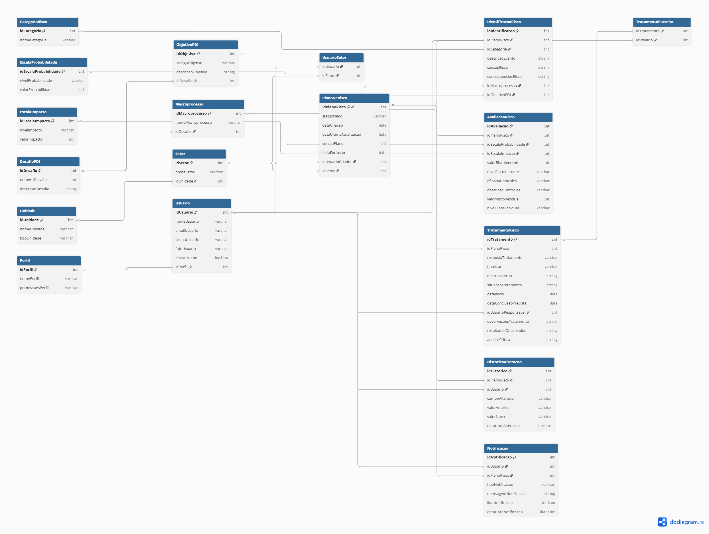

<strong>Levantamento de riscos</strong>

## 2. ATORES (USUÁRIOS) DO SISTEMA

O sistema possui quatro atores principais, organizados por nível de autoridade e escopo de atuação, alinhados ao modelo das três linhas de defesa.

---

### 2.1 Administrador do Sistema

**Perfil:** Responsável técnico pela configuração e manutenção do sistema.

**Responsabilidades:**

- Gerenciar usuários, perfis e permissões de acesso
- Configurar unidades organizacionais, setores e departamentos
- Configurar parâmetros globais do sistema (categorias de risco, escalas de probabilidade, impacto, níveis de risco)
- Gerenciar logs de auditoria e acessos
- Realizar backups e manutenção técnica

---

### 2.2 Gestor da Unidade (Gestor de Risco — 2ª Linha de Defesa)

**Perfil:** Pró-Reitores, Diretores de Unidades, Coordenadores. Responsável pela supervisão e monitoramento dos riscos no âmbito de toda a unidade ou conjunto de subunidades.

**Responsabilidades:**

- Visualizar e consolidar todos os riscos da unidade sob sua gestão
- Aprovar planos de tratamento elaborados pelos gestores de setor
- Realizar o remanejamento (redistribuição) de riscos entre subunidades
- Monitorar indicadores e dashboards da unidade completa
- Comunicar riscos extremos ao Comitê de Governança
- Gerar relatórios consolidados da unidade

---

### 2.3 Gestor de Setor (Gestor Responsável pelo Risco — 1ª Linha de Defesa)

**Perfil:** Chefes de Departamento, Coordenadores de Curso, Responsáveis por setores administrativos. Atua na operacionalização do gerenciamento de riscos dentro de sua subunidade.

**Responsabilidades:**

- Cadastrar novos riscos (identificação e análise)
- Preencher e editar planos de análise de risco
- Avaliar probabilidade, impacto e eficácia dos controles
- Definir e registrar ações de tratamento (mitigar, transferir, evitar, aceitar)
- Acompanhar a situação dos planos (não iniciado, em execução, concluído)
- Visualizar o dashboard restrito ao seu setor
- Gerar relatório PDF do plano de risco
- Monitorar riscos sob sua responsabilidade

---

### 2.4 Servidor / Colaborador (Usuário Básico — 1ª Linha de Defesa)

**Perfil:** Servidores técnicos e docentes que participam da identificação e acompanhamento de riscos em seus processos de trabalho.

**Responsabilidades:**

- Visualizar riscos cadastrados no seu setor (somente leitura)
- Registrar observações ou atualizações sobre riscos existentes
- Receber notificações sobre riscos e ações relacionadas ao seu setor

---

## 3. REQUISITOS FUNCIONAIS

Os requisitos funcionais estão organizados pelos módulos do sistema.

---

### RF01 — Módulo de Autenticação e Controle de Acesso

| ID | Requisito |
| --- | --- |
| RF01.1 | O sistema deve permitir login com e-mail corporativo e senha |
| RF01.2 | O sistema deve suportar controle de acesso baseado em perfis (Administrador, Gestor da Unidade, Gestor de Setor, Servidor) |
| RF01.3 | O sistema deve permitir que o usuário altere sua senha |
| RF01.4 | O sistema deve exibir a tela de perfil do usuário com nome, e-mail, departamento/setor e foto |
| RF01.5 | Um usuário pode estar associado a mais de um departamento/setor |
| RF01.6 | O Administrador pode criar, editar, ativar e desativar usuários |
| RF01.7 | O sistema deve registrar logs de acesso e alterações realizadas |

---

### RF02 — Módulo de Configuração Institucional

| ID | Requisito |
| --- | --- |
| RF02.1 | O Administrador deve poder cadastrar e gerenciar unidades organizacionais (ex: Pró-Reitorias, Centros) |
| RF02.2 | O Administrador deve poder cadastrar subunidades (departamentos, setores, coordenações) vinculadas às unidades |
| RF02.3 | O sistema deve permitir configurar as escalas de Probabilidade (1-Muito Baixa a 5-Muito Alta) |
| RF02.4 | O sistema deve permitir configurar as escalas de Impacto (1-Muito Baixo a 5-Muito Alto) |
| RF02.5 | O sistema deve permitir configurar as categorias/tipologias de risco (Estratégico, Operacional, Integridade, Imagem, Legal/Conformidade, Financeiro/Orçamentário, Ambiente Externo) |
| RF02.6 | O sistema deve permitir configurar os níveis de risco (Baixo, Moderado, Alto, Extremo) e suas faixas de cálculo |
| RF02.7 | O sistema deve permitir configurar os macroprocessos institucionais |
| RF02.8 | O sistema deve permitir configurar os desafios estratégicos e objetivos do PDI |

---

### RF03 — Módulo de Cadastro de Riscos (Formulário de Análise de Risco)

O formulário é dividido em três seções principais, correspondentes às etapas metodológicas:

### Seção 1 — Identificação e Análise

| ID | Requisito |
| --- | --- |
| RF03.1 | O sistema deve permitir selecionar o setor/departamento responsável pelo risco |
| RF03.2 | O sistema deve permitir classificar a tipologia do risco (dropdown com as categorias configuradas) |
| RF03.3 | O sistema deve permitir vincular o risco a um macroprocesso institucional |
| RF03.4 | O sistema deve permitir vincular o risco a um desafio e objetivo do PDI |
| RF03.5 | O sistema deve permitir descrever detalhadamente o evento de risco identificado |
| RF03.6 | O sistema deve permitir registrar as causas do risco |
| RF03.7 | O sistema deve permitir registrar as consequências/efeitos do risco |

### Seção 2 — Avaliação

| ID | Requisito |
| --- | --- |
| RF03.8 | O sistema deve permitir selecionar o nível de Probabilidade (dropdown) |
| RF03.9 | O sistema deve permitir selecionar o nível de Impacto (dropdown) |
| RF03.10 | O sistema deve calcular automaticamente o Risco Inerente (Probabilidade × Impacto) |
| RF03.11 | O sistema deve exibir o Nível de Risco Inerente (Baixo/Moderado/Alto/Extremo) com destaque visual colorido |
| RF03.12 | O sistema deve permitir selecionar a Eficácia dos Controles Internos existentes (Inexistente, Fraco, Mediano, Satisfatório, Forte) |
| RF03.13 | O sistema deve calcular automaticamente o Risco Residual (Risco Inerente × Fator de Avaliação dos Controles) |
| RF03.14 | O sistema deve exibir o Nível de Risco Residual com destaque visual colorido |
| RF03.15 | O sistema deve permitir descrever os controles internos já aplicados |

### Seção 3 — Tratamento

| ID | Requisito |
| --- | --- |
| RF03.16 | O sistema deve permitir selecionar a Resposta ao Risco (Mitigar, Transferir, Evitar, Aceitar) |
| RF03.17 | O sistema deve permitir registrar a Ação de Mitigação/Contingência (descrição detalhada) |
| RF03.18 | O sistema deve permitir registrar o tipo de ação (Preventiva, Corretiva, Compensatória) |
| RF03.19 | O sistema deve permitir definir a Situação do tratamento (Não Iniciado, Em Execução, Concluído, Atrasado) |
| RF03.20 | O sistema deve permitir registrar Data de Início e Data Prevista de Conclusão do tratamento |
| RF03.21 | O sistema deve permitir registrar o responsável pela execução da ação |
| RF03.22 | O sistema deve permitir registrar parceiros/intervenientes na ação |
| RF03.23 | O sistema deve permitir registrar observações e resultados observados |
| RF03.24 | O sistema deve permitir registrar ações futuras para aperfeiçoamento |

---

### RF05 — Módulo de Listagem e Gerenciamento de Formulários

| ID | Requisito |
| --- | --- |
| RF05.1 | O sistema deve exibir a lista de todos os formulários/planos cadastrados com: nome, departamento, status, data de cadastro e ações (visualizar, editar, excluir) |
| RF05.2 | O sistema deve indicar visualmente o status de cada formulário como **"Com tratamento"** (seção de tratamento preenchida) ou **"Sem tratamento"** (seção de tratamento não preenchida) |
| RF05.3 | O sistema deve permitir filtrar os formulários por: tipologia, nível de risco, unidade, status, responsável |
| RF05.4 | O sistema deve permitir pesquisar formulários por texto livre |
| RF05.5 | O sistema deve exibir contadores de totais: total de formulários e total sem tratamento |
| RF05.6 | O sistema deve permitir criar um novo formulário diretamente pela listagem (ação rápida) |
| RF05.7 | O Gestor de Setor visualiza apenas os formulários do seu setor; o Gestor da Unidade visualiza todos os formulários da unidade |

---

### RF06 — Módulo de Visualização do Plano de Risco

| ID | Requisito |
| --- | --- |
| RF06.1 | O sistema deve exibir uma tela de visualização somente leitura de um plano de risco, com todos os campos preenchidos organizados nas seções (Identificação, Avaliação, Tratamento) |
| RF06.2 | A tela de visualização deve exibir o status atual do plano (Com tratamento / Sem tratamento) |
| RF06.3 | A tela de visualização deve oferecer o botão "Gerar Relatório PDF" |
| RF06.4 | A tela de visualização deve oferecer o botão "Editar Plano" para usuários com permissão |

---

### RF07 — Módulo de Dashboard

| ID | Requisito |
| --- | --- |
| RF07.1 | O dashboard deve exibir o total de riscos cadastrados |
| RF07.2 | O dashboard deve exibir o total de riscos sem tratamento |
| RF07.3 | O dashboard deve exibir o total de riscos com tratamento |
| RF07.4 | O dashboard deve exibir a Matriz de Impacto × Probabilidade interativa, com quantitativo de riscos por célula |
| RF07.5 | O dashboard deve exibir o gráfico de Distribuição por Categoria/Tipologia de Risco (gráfico de rosca/pizza) |
| RF07.6 | O dashboard deve exibir o gráfico de Riscos por Departamento (gráfico de barras horizontais) |
| RF07.7 | O dashboard deve exibir a data/hora da última atualização dos dados |
| RF07.8 | O Gestor da Unidade visualiza o dashboard consolidado de toda a unidade; o Gestor de Setor visualiza apenas seu setor |
| RF07.9 | O dashboard deve permitir filtro por unidade para o Gestor da Unidade |

---

### RF08 — Módulo de Administração de Usuários (Tela de Admin)

| ID | Requisito |
| --- | --- |
| RF08.1 | O Administrador deve poder listar todos os usuários cadastrados com seus perfis e unidades |
| RF08.2 | O Administrador deve poder criar novos usuários informando: nome, e-mail, perfil, unidade/setor |
| RF08.3 | O Administrador deve poder editar os dados e o perfil de usuários existentes |
| RF08.4 | O Administrador deve poder ativar e desativar usuários |
| RF08.5 | O Gestor da Unidade deve poder visualizar e gerenciar os usuários da sua unidade (gestores de setor e servidores) |
| RF08.6 | O sistema deve permitir associar um usuário a múltiplos departamentos/setores |

---

### RF09 — Módulo de Geração de Relatórios

| ID | Requisito |
| --- | --- |
| RF09.1 | O sistema deve permitir exportar um plano de risco individual em formato PDF |
| RF09.2 | O sistema deve permitir exportar o Mapa de Riscos da unidade/setor em PDF ou planilha |
| RF09.3 | O sistema deve gerar relatório da Matriz Probabilidade × Impacto |
| RF09.4 | O sistema deve gerar relatório de acompanhamento dos planos de tratamento |
| RF09.5 | O relatório deve incluir: dados de identificação, avaliação, tratamento e monitoramento do risco |

---

### RF10 — Módulo de Monitoramento

| ID | Requisito |
| --- | --- |
| RF10.1 | O sistema deve permitir registrar resultados observados após a execução de ações de tratamento |
| RF10.2 | O sistema deve permitir registrar a análise crítica sobre a efetividade dos controles |
| RF10.3 | O sistema deve alertar (notificar) sobre planos com data prevista de conclusão vencida (status: Atrasado) |
| RF10.4 | O sistema deve permitir reavaliação periódica do risco, gerando um histórico de versões |
| RF10.5 | O sistema deve exibir o histórico de alterações de um plano (quem alterou, o quê e quando) |

---

## 4. REQUISITOS NÃO FUNCIONAIS

| ID | Requisito |
| --- | --- |
| RNF01 | O sistema deve ser uma aplicação web responsiva, acessível por navegadores modernos |
| RNF02 | O sistema deve utilizar autenticação segura (HTTPS, tokens JWT ou sessão segura) |
| RNF03 | O sistema deve garantir que um usuário acesse apenas os dados da sua unidade/setor, conforme perfil |
| RNF04 | O sistema deve manter log de auditoria de todas as operações de criação, edição e exclusão |
| RNF05 | O sistema deve suportar múltiplos usuários simultâneos |
| RNF06 | A interface deve ser em português brasileiro |
| RNF07 | A geração de relatório PDF deve ser feita do lado do servidor |
| RNF08 | O sistema deve ter tempo de resposta adequado para operações comuns (< 3 segundos) |

---

## 5. REGRAS DE NEGÓCIO

| ID | Regra |
| --- | --- |
| RN01 | O Nível de Risco Inerente é calculado como: Probabilidade × Impacto |
| RN02 | O Risco Residual é calculado como: Risco Inerente × Fator de Avaliação dos Controles (Forte=0,2; Satisfatório=0,4; Mediano=0,6; Fraco=0,8; Inexistente=1,0) |
| RN03 | A classificação do nível de risco segue as faixas: Baixo (< 4), Moderado (4 ≤ R < 12), Alto (12 ≤ R < 20), Extremo (≥ 20) |
| RN04 | Riscos de nível Baixo devem receber resposta "Aceitar"; Moderado e Alto devem receber "Mitigar/Evitar"; Extremo deve receber "Evitar" com escalonamento ao Comitê de Governança |
| RN05 | Apenas o Gestor de Setor responsável ou o Gestor da Unidade podem editar um plano de risco |
| RN06 | O status do formulário é **"Sem tratamento"** enquanto a seção de Tratamento não estiver preenchida; torna-se **"Com tratamento"** após o preenchimento da ação de tratamento |
| RN07 | Apenas o Gestor de Setor responsável ou o Gestor da Unidade podem editar um plano de risco |
| RN08 | O Gestor da Unidade pode visualizar e redirecionar (remanejar) formulários entre subunidades de sua unidade |
| RN09 | A data de última atualização exibida no dashboard é a data de cadastro do risco mais recente ou a data de vigência do tratamento mais recente |

---

## 6. RESUMO DE ATORES × FUNCIONALIDADES

| Funcionalidade | Administrador | Gestor da Unidade | Gestor de Setor | Servidor |
| --- | --- | --- | --- | --- |
| Gerenciar usuários (sistema) | ✅ | — | — | — |
| Gerenciar usuários da unidade | — | ✅ | — | — |
| Configurar parâmetros do sistema | ✅ | — | — | — |
| Cadastrar novo risco | — | ✅ | ✅ | — |
| Editar plano de risco | — | ✅ | ✅ | — |
| Visualizar plano de risco | ✅ | ✅ | ✅ | ✅ |
| Registrar observações no risco | — | ✅ | ✅ | ✅ |
| Aprovar plano de tratamento | — | ✅ | — | — |
| Remanejar riscos entre setores | — | ✅ | — | — |
| Dashboard da unidade completa | — | ✅ | — | — |
| Dashboard do setor | — | — | ✅ | — |
| Listar formulários (setor) | — | — | ✅ | ✅ |
| Listar formulários (unidade) | — | ✅ | — | — |
| Gerar relatório PDF | — | ✅ | ✅ | — |
| Exportar Mapa de Riscos | — | ✅ | ✅ | — |
| Monitorar e registrar resultados | — | ✅ | ✅ | — |
| Excluir plano de risco | ✅ | ✅ | ✅* | — |
| Gerenciar log de auditoria | ✅ | — | — | — |

> *Gestor de Setor pode excluir apenas planos do seu próprio setor, somente enquanto na fase "Identificado".
>

---

## 7. ENTIDADES PRINCIPAIS IDENTIFICADAS

*(Base para o Diagrama de Classes e Diagrama ER)*

- **Usuario** (id, nome, email, senha, perfil, foto, ativo)
- **Perfil** (id, nome, permissões)
- **Unidade** (id, nome, tipo)
- **Subunidade/Setor** (id, nome, unidade_id)
- **UsuarioSetor** (usuario_id, setor_id) — associação N:M
- **PlanoDeRisco** (id, setor_id, usuario_criador_id, status, data_criacao, data_ultima_atualizacao)
    - *status*: "Sem tratamento" | "Com tratamento"
- **IdentificacaoRisco** (id, plano_id, tipologia, macroprocesso, objetivo_pdi, descricao_evento, causas, consequencias)
- **AvaliacaoRisco** (id, plano_id, probabilidade, impacto, risco_inerente, nivel_risco_inerente, eficacia_controles, descricao_controles, risco_residual, nivel_risco_residual)
- **TratamentoRisco** (id, plano_id, resposta, tipo_acao, descricao_acao, situacao, data_inicio, data_conclusao_prevista, responsavel, parceiros, observacoes, resultados_observadosx, analise_critica)
- **HistoricoAlteracao** (id, plano_id, usuario_id, campo_alterado, valor_anterior, valor_novo, data_hora)
- **Macroprocesso** (id, nome, desafio_pdi)
- **ObjetivoPDI** (id, codigo, descricao, desafio_id)
- **DesafioPDI** (id, numero, descricao)
- **Notificacao** (id, usuario_id, plano_id, tipo, mensagem, lida, data_hora)

<strong>Diagramas</strong>

<strong>Código do Diagrama de Uso</strong>

<pre>
    flowchart TD
%% ATORES
    A4["ADMINISTRADOR"]
    A3["GESTOR DA UNIDADE"]
    A2["GESTOR DE SETOR"]
    A1["SERVIDOR/COLABORADOR"]

    subgraph "Sistema de Gestão de Riscos "
        
        
        %% Acesso
        uc1([Autenticar no Sistema])
        
        %%  Administração
        uc6([Administrar Sistema e Usuários])
        
        %% Operação e Cadastro
        uc2([Cadastrar/Editar Plano de Risco])
        ex1([Escalonamento])
        
        %% Listagem e Observação
        uc8([Listar/Filtrar Formulários])
        ex3([Remanejar Riscos entre Setores])
        uc7([Registrar Observações])
        
        %% Monitoramento e Saída
        uc3([Monitorar Resultados e Planos])
        ex2([Notificar Planos Atrasados])
        uc4([Visualizar Dashboards])
        uc5([Gerar Relatórios e PDF])
    end

    %% Relacionamentos de Inclusão 
    uc2 -. include .-> uc1
    uc3 -. include .-> uc1
    uc4 -. include .-> uc1
    uc5 -. include .-> uc1
    uc8 -. include .-> uc1

    %% Relacionamentos de Extensão 
    ex1 -. extend .-> uc2
    ex2 -. extend .-> uc3
    ex3 -. extend .-> uc8

    %% ligação: Administrador
    A4 --> uc6
    A4 --> uc5

    %% ligação: Gestor da Unidade
    A3 --> uc2
    A3 --> uc4
    A3 --> uc8
    A3 --> ex3

    %% ligação: Gestor de Setor
    A2 --> uc2
    A2 --> uc3
    A2 --> uc4
    A2 --> uc5

    %% Ligação: Servidor
    A1 --> uc8
    A1 --> uc7
    A1 --> uc1
</pre>

<strong>Código do Diagrama Entidade Relacionamento</strong>

<pre>

Table Unidade {
    idUnidade int [pk, increment]
    nomeUnidade varchar
    tipoUnidade varchar
}

Table Setor {
    idSetor int [pk, increment]
    nomeSetor varchar
    idUnidade int
}

Table Perfil {
    idPerfil int [pk, increment]
    nomePerfil varchar
    permissoesPerfil varchar
}

Table Usuario {
    idUsuario int [pk, increment]
    nomeUsuario varchar
    emailUsuario varchar
    senhaUsuario varchar
    fotoUsuario varchar
    ativoUsuario boolean
    idPerfil int
}

Table UsuarioSetor {
    idUsuario int
    idSetor int
}

Table CategoriaRisco {
    idCategoria int [pk, increment]
    nomeCategoria varchar
}

Table EscalaProbabilidade {
    idEscalaProbabilidade int [pk, increment]
    nivelProbabilidade varchar
    valorProbabilidade int
}

Table EscalaImpacto {
    idEscalaImpacto int [pk, increment]
    nivelImpacto varchar
    valorImpacto int
}

Table PlanoDeRisco {
    idPlanoRisco int [pk, increment]
    statusPlano varchar
    dataCriacao date
    dataUltimaAtualizacao date
    versaoPlano int
    dataExclusao date
    idUsuarioCriador int
    idSetor int
}

Table IdentificacaoRisco {
    idIdentificacao int [pk, increment]
    idPlanoRisco int
    idCategoria int
    descricaoEvento string
    causasRisco string
    consequenciasRisco string
    idMacroprocesso int
    idObjetivoPDI int
}

Table AvaliacaoRisco {
    idAvaliacao int [pk, increment]
    idPlanoRisco int
    idEscalaProbabilidade int
    idEscalaImpacto int
    valorRiscoInerente int
    nivelRiscoInerente varchar
    eficaciaControles varchar
    descricaoControles varchar
    valorRiscoResidual int
    nivelRiscoResidual varchar
}

Table TratamentoRisco {
    idTratamento int [pk, increment]
    idPlanoRisco int
    respostaTratamento varchar
    tipoAcao varchar
    descricaoAcao string
    situacaoTratamento string
    dataInicio date
    dataConclusaoPrevista date
    idUsuarioResponsavel int
    observacoesTratamento string
    resultadosObservados string
    analiseCritica string
}

Table DesafioPDI {
    idDesafio int [pk, increment]
    numeroDesafio int
    descricaoDesafio string
}

Table ObjetivoPDI {
    idObjetivo int [pk, increment]
    codigoObjetivo varchar
    descricaoObjetivo string
    idDesafio int
}

Table Macroprocesso {
    idMacroprocesso int [pk, increment]
    nomeMacroprocesso varchar
    idDesafio int
}

Table HistoricoAlteracao {
    idHistorico int [pk, increment]
    idPlanoRisco int
    idUsuario int
    campoAlterado varchar
    valorAnterior varchar
    valorNovo varchar
    dataHoraAlteracao datetime
}

Table Notificacao {
    idNotificacao int [pk, increment]
    idUsuario int
    idPlanoRisco int
    tipoNotificacao varchar
    mensagemNotificacao string
    lidaNotificacao boolean
    dataHoraNotificacao datetime
}

Table TratamentoParceiro {
    idTratamento int
    idUsuario int
}

Ref: Setor.idUnidade > Unidade.idUnidade
Ref: Usuario.idPerfil > Perfil.idPerfil
Ref: UsuarioSetor.idUsuario > Usuario.idUsuario
Ref: UsuarioSetor.idSetor > Setor.idSetor

Ref: PlanoDeRisco.idSetor > Setor.idSetor
Ref: PlanoDeRisco.idUsuarioCriador > Usuario.idUsuario

Ref: IdentificacaoRisco.idPlanoRisco > PlanoDeRisco.idPlanoRisco
Ref: IdentificacaoRisco.idCategoria > CategoriaRisco.idCategoria
Ref: IdentificacaoRisco.idMacroprocesso > Macroprocesso.idMacroprocesso
Ref: IdentificacaoRisco.idObjetivoPDI > ObjetivoPDI.idObjetivo

Ref: AvaliacaoRisco.idPlanoRisco > PlanoDeRisco.idPlanoRisco
Ref: AvaliacaoRisco.idEscalaProbabilidade > EscalaProbabilidade.idEscalaProbabilidade
Ref: AvaliacaoRisco.idEscalaImpacto > EscalaImpacto.idEscalaImpacto

Ref: TratamentoRisco.idPlanoRisco - PlanoDeRisco.idPlanoRisco

Ref: TratamentoRisco.idUsuarioResponsavel > Usuario.idUsuario

Ref: ObjetivoPDI.idDesafio > DesafioPDI.idDesafio
Ref: Macroprocesso.idDesafio > DesafioPDI.idDesafio

Ref: HistoricoAlteracao.idPlanoRisco > PlanoDeRisco.idPlanoRisco
Ref: HistoricoAlteracao.idUsuario > Usuario.idUsuario

Ref: Notificacao.idPlanoRisco > PlanoDeRisco.idPlanoRisco
Ref: Notificacao.idUsuario > Usuario.idUsuario

Ref: TratamentoParceiro.idTratamento > TratamentoRisco.idTratamento
Ref: TratamentoParceiro.idUsuario > Usuario.idUsuario
</pre>

<strong>Código do Diagrama de Classe</strong>

<pre>
classDiagram

class Perfil {
    +int id
    +String nome
    +String permissoes
}

class Usuario {
    +int id
    +String nome
    +String email
    +String senha
    +String foto
    +boolean ativo
    +int perfil_id
}

class Unidade {
    +int id
    +String nome
    +String tipo
}

class Setor {
    +int id
    +String nome
    +int unidade_id
}

class UsuarioSetor {
    +int usuario_id
    +int setor_id
}

Perfil "1" --> "N" Usuario
Unidade "1" --> "N" Setor
Usuario "1" --> "N" UsuarioSetor
Setor "1" --> "N" UsuarioSetor

class PlanoDeRisco {
    +int id
    +String status
    +Date data_criacao
    +Date data_ultima_atualizacao
    +int versao
    +Date excluido_em
    +int usuario_criador_id
    +int setor_id
}

Setor "1" --> "N" PlanoDeRisco
Usuario "1" --> "N" PlanoDeRisco : cria

class DesafioPDI {
    +int id
    +int numero
    +String descricao
}

class Macroprocesso {
    +int id
    +String nome
    +int desafio_id
}

class ObjetivoPDI {
    +int id
    +String codigo
    +String descricao
    +int desafio_id
}

class CategoriaRisco {
    +int id
    +String nome
}

DesafioPDI "1" --> "N" Macroprocesso
DesafioPDI "1" --> "N" ObjetivoPDI

class IdentificacaoRisco {
    +int id
    +int plano_id
    +int categoria_id
    +String descricao_evento
    +String causas
    +String consequencias
    +int macroprocesso_id   
    +int objetivo_pdi_id
}

PlanoDeRisco "1" *-- "1" IdentificacaoRisco
CategoriaRisco "1" --> "N" IdentificacaoRisco
IdentificacaoRisco --> Macroprocesso
IdentificacaoRisco --> ObjetivoPDI

class EscalaProbabilidade {
    +int id
    +String nivel
    +int valor
}

class EscalaImpacto {
    +int id
    +String nivel
    +int valor
}

class AvaliacaoRisco {
    +int id
    +int plano_id
    +int probabilidade_id
    +int impacto_id
    +int risco_inerente
    +String nivel_risco_inerente
    +String eficacia_controles
    +String descricao_controles
    +int risco_residual
    +String nivel_risco_residual
}

PlanoDeRisco "1" *-- "1" AvaliacaoRisco
EscalaProbabilidade "1" --> "N" AvaliacaoRisco
EscalaImpacto "1" --> "N" AvaliacaoRisco

class TratamentoRisco {
    +int id
    +int plano_id
    +String resposta
    +String tipo_acao
    +String descricao_acao
    +String situacao
    +Date data_inicio
    +Date data_conclusao_prevista
    +int responsavel_id
    +String observacoes
    +String resultados_observados
    +String analise_critica
}

class TratamentoParceiro {
    +int tratamento_id
    +int usuario_id
}

PlanoDeRisco "1" *-- "0..1" TratamentoRisco
TratamentoRisco "1" --> "N" TratamentoParceiro
Usuario "1" --> "N" TratamentoParceiro

class HistoricoAlteracao {
    +int id
    +int plano_id
    +int usuario_id
    +String campo_alterado
    +String valor_anterior
    +String valor_novo
    +DateTime data_hora
}

class Notificacao {
    +int id
    +int usuario_id
    +int plano_id
    +String tipo
    +String mensagem
    +boolean lida
    +DateTime data_hora
}

PlanoDeRisco "1" --> "N" HistoricoAlteracao
Usuario "1" --> "N" HistoricoAlteracao : realiza

PlanoDeRisco "1" --> "N" Notificacao
Usuario "1" --> "N" Notificacao
</pre>

