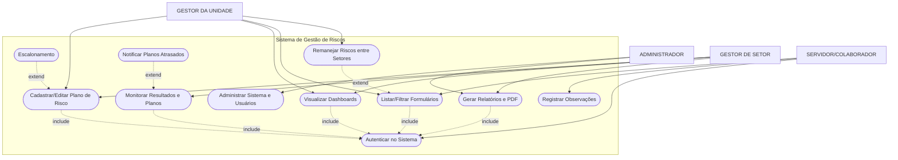

<strong>Código do diagrama</strong>

<pre>

    flowchart TD
    actor1["👤 Usuário"]
    actor2["👤 Administrador"]

    subgraph Sistema
        uc1([Realizar Login])
        uc2([Gerar relatório])
        uc3([Gerenciar usuários])
    end

    actor1 --> uc1
    actor1 --> uc2
    actor2 --> uc3
    actor2 --> uc2
    actor2 --> uc1
</pre>

